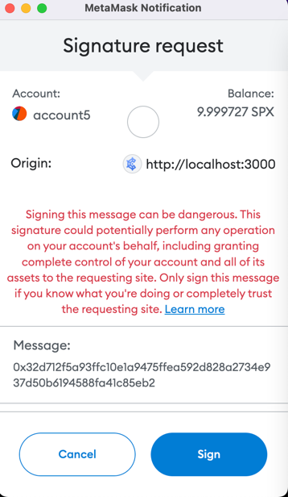

# metamask-sign-recover-pubkey

#### How to recover pubkey by metamask signature, 

### Metamask eth_getEncryptionPublicKey function cannot use 

```ts
ethereum
  .request({
    method: 'eth_getEncryptionPublicKey',
    params: [accounts[0]], // you must have access to the specified account
  })

 ```

### So we need get pubkey from signature

img_1.png

```ts
  const {ethereum}: any = window;
 
  // message hex
  let message = arrayify(hashMessage('generate_pubkey'));
  let 0xhex = "0x" + ua2hex(message)
  const sign = await ethereum.request({method: "eth_sign", params: [address, 0xhex]});
  const pk = signatureToPubkey(
    sign,
    Buffer.from(message)
  )

  console.log('pubkey:', pk)
  
  //pubkey : AiJbGH7xjbW7PoDClLDb3On9YgiWXQMq2cHIA1v4lfPj
  return pk;
